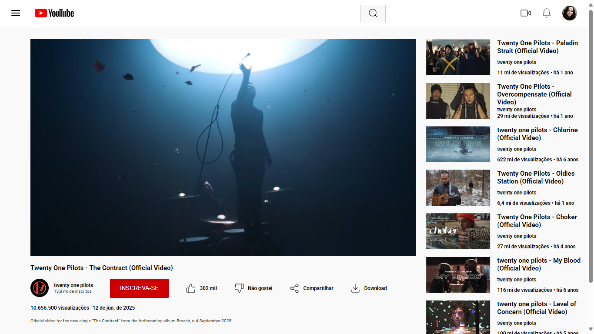

# Clone da Página do YouTube - Desafio Flexbox

Este projeto foi desenvolvido como parte do Desafio de Flexbox, com o objetivo de praticar os conceitos de CSS Flexbox por meio da clonagem da interface do YouTube. A proposta é aplicar o que foi aprendido durante os estudos e dar um toque pessoal ao visual da página.

## Design de Referência

O design para o projeto foi disponibilizado no Figma, acesse pelo link abaixo:

[Figma - Desafio de Flexbox](https://www.figma.com/file/lrRWUZPKnqMDZrSDJmZxUS/Desafio-de-Flexbox---DIO?node-id=0%3A1)  

## Tecnologias Utilizadas

- HTML5
- CSS3

## Resultado


## Como Visualizar

1. Clone o repositório:
   ```bash
   git clone https://github.com/leticia-farias/dio-desafio-flexbox.git

2. Acesse a pasta do projeto:
   ```bash
   cd dio-desafio-flexbox
3. Abra o arquivo `index.html` no seu navegador:
- Pelo explorador de arquivos, clicando duas vezes no arquivo;  
- Ou pelo terminal, usando um dos comandos abaixo conforme seu sistema:
  - Windows:
    ```bash
    start index.html
  - macOS:
    ```bash
    open index.html
  - Linux:
    ```bash
    xdg-open index.html

